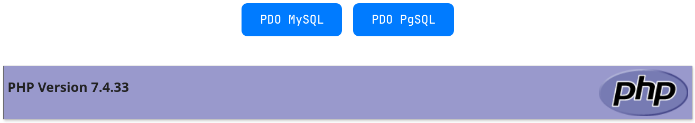
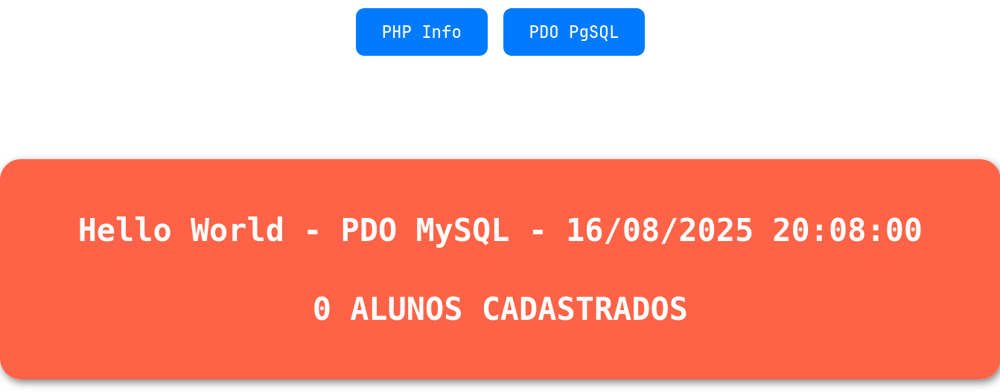
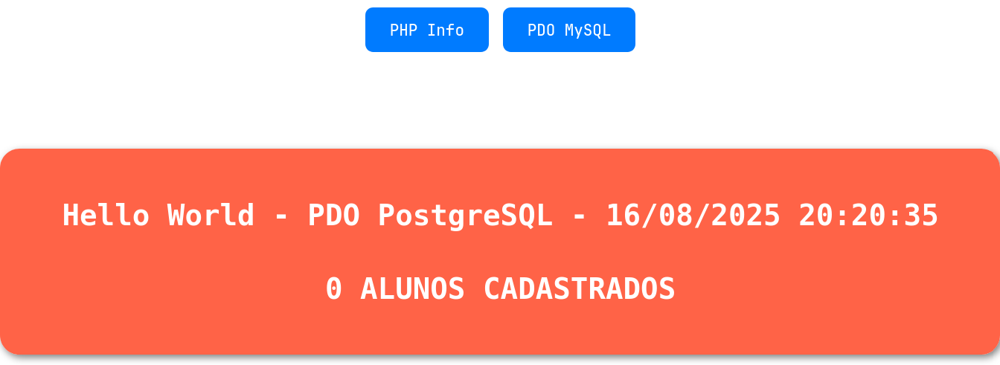
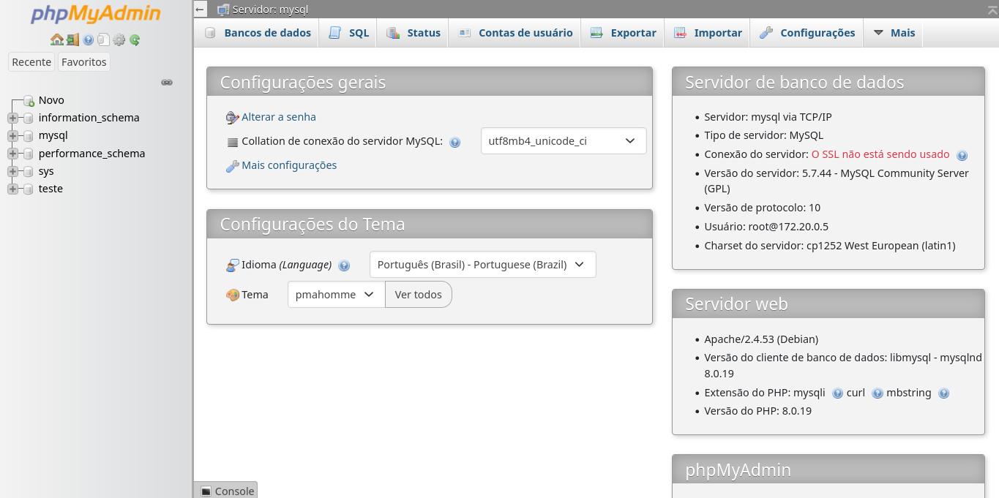
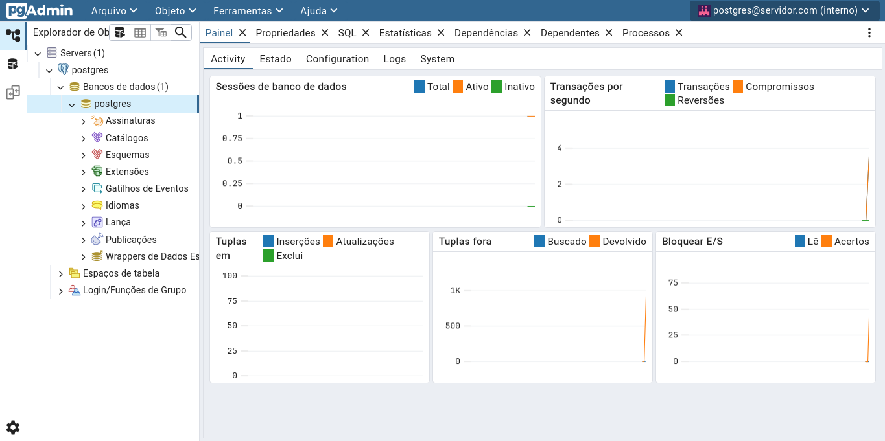

# LAMP Compose - Ambiente Docker

Este repositório é um fork de [birazn/lamp-compose](https://github.com/birazn/lamp-compose), com ajustes para rodar um ambiente **LAMP** usando **Docker Compose**.

Aqui você encontra um ambiente completo com:

- **PHP 7.4 + Apache**
- **MySQL 5.7**
- **phpMyAdmin 5.2**
- **PostgreSQL 12**
- **pgAdmin 4**

## Principais telas

<details>
<summary>Screenshots</summary>
<br />
    <h3 align="center">PHP + Apache - localhost:80/index.php</h3>
    <div align="center"></div>
    <br />
    <h3 align="center">PHP + Apache - localhost:80/mysql.php</h3>
    <div align="center"></div>
    <br />
    <h3 align="center">PHP + Apache - localhost:80/pgsql.php</h3>
    <div align="center"></div>
    <br />
    <h3 align="center">phpMyAdmin - localhost:8080</h3>
    <div align="center"></div>
    <br />
    <h3 align="center">PgAdmin - localhost:8081</h3>
    <div align="center"></div>    
</details>

---

## Tecnologias

- [Docker](https://www.docker.com/)
- [Docker Compose](https://docs.docker.com/compose/)
- [PHP + Apache](https://hub.docker.com/layers/library/php/7.4-apache/images/sha256-d85f6e9fbbbaba46cf024a70075b871bee1bec59a898765f8c756bc017666e81)
- [MySQL](https://hub.docker.com/layers/library/mysql/5.7/images/sha256-dab0a802b44617303694fb17d166501de279c3031ddeb28c56ecf7fcab5ef0da) / [PostgreSQL](https://hub.docker.com/layers/library/postgres/12/images/sha256-f723de5d60f072d2a19826b9b67023043e4a7fae493ab5462fa46cf9f7581589)
- [phpMyAdmin](https://hub.docker.com/layers/phpmyadmin/phpmyadmin/5.2.0/images/sha256-ae6dadd9cf3c158e42937788f7255fa820ea3daef0349226d8d43f32e76535e1) / [pgAdmin](https://hub.docker.com/r/dpage/pgadmin4)

---

## Como rodar

1. Clone o projeto:

```
git clone https://github.com/gustavogordoni/lamp-compose.git
cd lamp-compose
````

2. Suba os containers:

```
docker compose up -d
```

3. Acesse os serviços:

* **Aplicação PHP** → [http://localhost](http://localhost)
* **phpMyAdmin** → [http://localhost:8080](http://localhost:8080) (root / root)
* **pgAdmin** → [http://localhost:8081](http://localhost:8081) (postgres@servidor.com / postdba)
* **MySQL** → `localhost:3306` (root / root)
* **PostgreSQL** → `localhost:5432` (postgres / postdba)

---

## Estrutura

* `php/` → Dockerfile do container PHP + Apache
* `phpmyadmin/` → Dockerfile do container phpMyAdmin
* `web/` → PHP Info + Teste de conectividade com MySQL e PostgreSQL
* `postgres/` → Volume do Postgres
* `mysql/` → Volume do MySQL
* `docker-compose.yml` → Orquestra todos os serviços

---

## Relacionado

Este repositório pode ser usado em conjunto com o projeto [lamp-dashboard](https://github.com/gustavogordoni/lamp-dashboard), que fornece uma **interface em gráfica** feita em Java para gerenciar os containers deste `docker-compose`.
